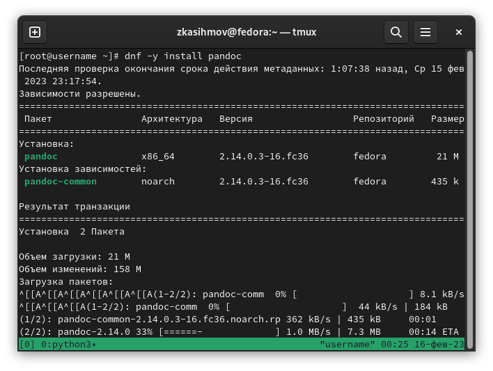

---
## Front matter
title: "Отчет по Лабораторной работе №1"
subtitle: "Установка и конфигурация операционной системы на виртуальную машину"
author: "Касымов Заур"

## Generic otions
lang: ru-RU
toc-title: "Содержание"

## Bibliography
bibliography: bib/cite.bib
csl: pandoc/csl/gost-r-7-0-5-2008-numeric.csl

## Pdf output format
toc: true # Table of contents
toc-depth: 2
lof: true # List of figures
lot: true # List of tables
fontsize: 12pt
linestretch: 1.5
papersize: a4
documentclass: scrreprt
## I18n polyglossia
polyglossia-lang:
  name: russian
  options:
	- spelling=modern
	- babelshorthands=true
polyglossia-otherlangs:
  name: english
## I18n babel
babel-lang: russian
babel-otherlangs: english
## Fonts
mainfont: PT Serif
romanfont: PT Serif
sansfont: PT Sans
monofont: PT Mono
mainfontoptions: Ligatures=TeX
romanfontoptions: Ligatures=TeX
sansfontoptions: Ligatures=TeX,Scale=MatchLowercase
monofontoptions: Scale=MatchLowercase,Scale=0.9
## Biblatex
biblatex: true
biblio-style: "gost-numeric"
biblatexoptions:
  - parentracker=true
  - backend=biber
  - hyperref=auto
  - language=auto
  - autolang=other*
  - citestyle=gost-numeric
## Pandoc-crossref LaTeX customization
figureTitle: "Рис."
tableTitle: "Таблица"
listingTitle: "Листинг"
lofTitle: "Список иллюстраций"
lotTitle: "Список таблиц"
lolTitle: "Листинги"
## Misc options
indent: true
header-includes:
  - \usepackage{indentfirst}
  - \usepackage{float} # keep figures where there are in the text
  - \floatplacement{figure}{H} # keep figures where there are in the text
---

# Цель работы

Целью данной работы является приобретение практических навыков установки операционной системы на виртуальную машину, настройки минимально необходимых для дальнейшей работы сервисов.

# Задание

Лабораторная работа подразумевает установку на виртуальную машину VirtualBox (https://www.virtualbox.org/) операционной системы Linux (дистрибутив Fedora).
Выполнение работы возможно как в дисплейном классе факультета физико-математических и естественных наук РУДН, так и дома. Описание выполнения работы приведено для дисплейного класса со следующими характеристиками техники:
Intel Core i3-550 3.2 GHz, 4 GB оперативной памяти, 80 GB свободного места на жёстком диске;
ОС Linux Gentoo (http://www.gentoo.ru/);
VirtualBox версии 7.0 или новее.
Для установки в виртуальную машину используется дистрибутив Linux Fedora (https://getfedora.org), вариант с менеджером окон i3 (https://spins.fedoraproject.org/i3/).
При выполнении лабораторной работы на своей технике вам необходимо скачать необходимый образ операционной системы (https://spins.fedoraproject.org/i3/download/index.html).

# Выполнение лабораторной работы
Войдем в ОС под заданной нами при установке учётной записью.
Нажмем комбинацию Win+Enter для запуска терминала.
Переключимся на роль супер-пользователя с помощью команды sudo -i:

## Обновим все пакеты(рис.3.1)

{#fig:001 width=70%}

## Повышение комфорта работы(рис.3.2)

{#fig:001 width=70%}

## Автоматическое обновление(рис.3.3)

{#fig:001 width=70%}

Задаём необходимую конфигурацию в файле /etc/dnf/automatic.conf.

## Отключение SELinux, заменим SELINUX=enforcing на значение SELINUX=permissive(рис.3.4)

{#fig:001 width=70%}

Перезагрузим виртуальную машину.

## Установка драйверов для VirtualBox(рис.3.5)

{#fig:001 width=70%}

Переключимся  на роль супер-пользователя и установим DKMS(рис3.6)

{#fig:001 width=70%}

В меню виртуальной машины подключим образ диска дополнений гостевой ОС.
Подмонтируем диск и перезагрузим(рис.3.7):

{#fig:001 width=70%}

## Настройка раскладки клавиатуры(рис.3.8)

{#fig:001 width=70%}

## Установка программного обеспечения для создания документации.
Нажмем комбинацию Win+Enter для запуска терминала.
Запустите терминальный мультиплексор tmux:

tmux
Переключимся на роль супер-пользователя:

sudо -i

### Pandoc
Установим pandoc(рис.3.9, 3.10)

{#fig:001 width=70%}

{#fig:001 width=70%}

### Texlive установим с помощью команды dnf -y install texlive texlive-\* (рис.3.11)

{#fig:001 width=70%}

# Домашнее задание

Дождитесь загрузки графического окружения и откройте терминал. В окне терминала проанализируйте последовательность загрузки системы, выполнив команду dmesg. Можно просто просмотреть вывод этой команды:

dmesg | less

{#fig:001 width=70%}

Получите следующую информацию.
Версия ядра Linux (Linux version).
Частота процессора (Detected Mhz processor).
Модель процессора (CPU0).
Объём доступной оперативной памяти (Memory available).
Тип обнаруженного гипервизора (Hypervisor detected).
Тип файловой системы корневого раздела.
Последовательность монтирования файловых систем.

{#fig:001 width=70%}

# Выводы

Мы приобрели практические навыки установки операционной системы на виртуальную машину, настройки минимально необходимых для дальнейшей работы сервисов.

# Ссылки.unnumbered}

::: {#refs}
:::

Репозиторий ГитХаб: https://github.com/ZaurKasymov/study_2022-2023_os-intro.git
Видео на ютуб: https://youtu.be/d9qM9VJ4vTQ
