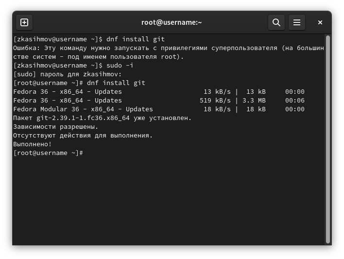
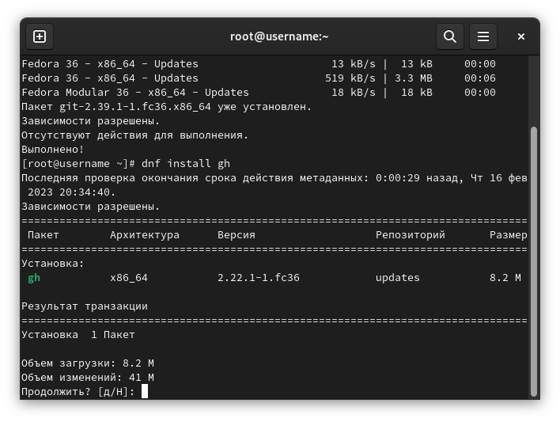
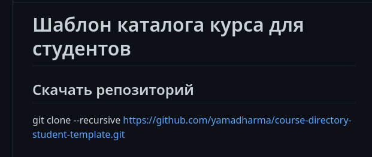
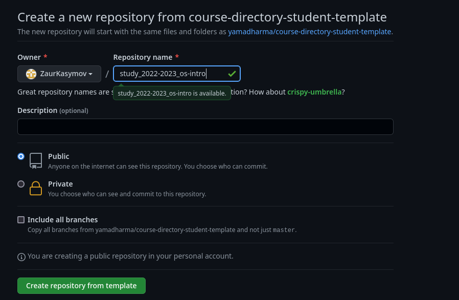
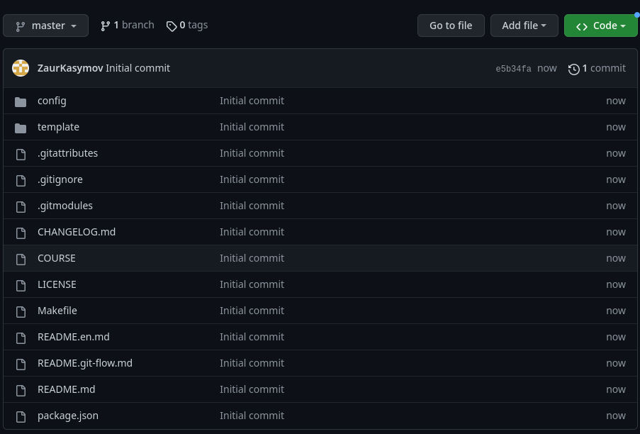
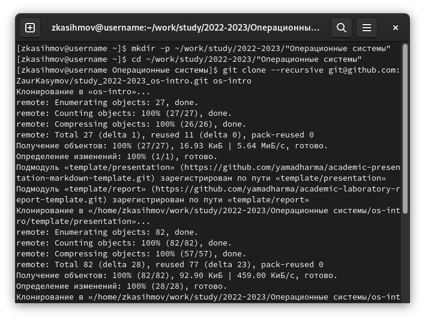
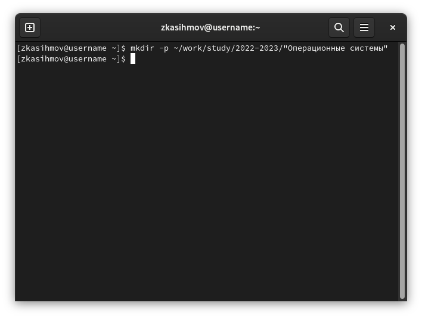

---
## Front matter
title: "Отчет по Лабораторной работе №2"
subtitle: "Первоначальна настройка git"
author: "Касымов Заур"

## Generic otions
lang: ru-RU
toc-title: "Содержание"

## Bibliography
bibliography: bib/cite.bib
csl: pandoc/csl/gost-r-7-0-5-2008-numeric.csl

## Pdf output format
toc: true # Table of contents
toc-depth: 2
lof: true # List of figures
lot: true # List of tables
fontsize: 12pt
linestretch: 1.5
papersize: a4
documentclass: scrreprt
## I18n polyglossia
polyglossia-lang:
  name: russian
  options:
	- spelling=modern
	- babelshorthands=true
polyglossia-otherlangs:
  name: english
## I18n babel
babel-lang: russian
babel-otherlangs: english
## Fonts
mainfont: PT Serif
romanfont: PT Serif
sansfont: PT Sans
monofont: PT Mono
mainfontoptions: Ligatures=TeX
romanfontoptions: Ligatures=TeX
sansfontoptions: Ligatures=TeX,Scale=MatchLowercase
monofontoptions: Scale=MatchLowercase,Scale=0.9
## Biblatex
biblatex: true
biblio-style: "gost-numeric"
biblatexoptions:
  - parentracker=true
  - backend=biber
  - hyperref=auto
  - language=auto
  - autolang=other*
  - citestyle=gost-numeric
## Pandoc-crossref LaTeX customization
figureTitle: "Рис."
tableTitle: "Таблица"
listingTitle: "Листинг"
lofTitle: "Список иллюстраций"
lotTitle: "Список таблиц"
lolTitle: "Листинги"
## Misc options
indent: true
header-includes:
  - \usepackage{indentfirst}
  - \usepackage{float} # keep figures where there are in the text
  - \floatplacement{figure}{H} # keep figures where there are in the text
---

# Цель работы

Изучить идеологию и применение средств контроля версий.
Освоить умения по работе с git.

# Теоретическое введение

* Системы контроля версий. Общие понятия
Системы контроля версий (Version Control System, VCS) применяются при работе нескольких человек над одним проектом. Обычно основное дерево проекта хранится в локальном или удалённом репозитории, к которому настроен доступ для участников проекта. При внесении изменений в содержание проекта система контроля версий позволяет их фиксировать, совмещать изменения, произведённые разными участниками проекта, производить откат к любой более ранней версии проекта, если это требуется.

В классических системах контроля версий используется централизованная модель, предполагающая наличие единого репозитория для хранения файлов. Выполнение большинства функций по управлению версиями осуществляется специальным сервером. Участник проекта (пользователь) перед началом работы посредством определённых команд получает нужную ему версию файлов. После внесения изменений, пользователь размещает новую версию в хранилище. При этом предыдущие версии не удаляются из центрального хранилища и к ним можно вернуться в любой момент. Сервер может сохранять не полную версию изменённых файлов, а производить так называемую дельта-компрессию — сохранять только изменения между последовательными версиями, что позволяет уменьшить объём хранимых данных.

Системы контроля версий поддерживают возможность отслеживания и разрешения конфликтов, которые могут возникнуть при работе нескольких человек над одним файлом. Можно объединить (слить) изменения, сделанные разными участниками (автоматически или вручную), вручную выбрать нужную версию, отменить изменения вовсе или заблокировать файлы для изменения. В зависимости от настроек блокировка не позволяет другим пользователям получить рабочую копию или препятствует изменению рабочей копии файла средствами файловой системы ОС, обеспечивая таким образом, привилегированный доступ только одному пользователю, работающему с файлом.

Системы контроля версий также могут обеспечивать дополнительные, более гибкие функциональные возможности. Например, они могут поддерживать работу с несколькими версиями одного файла, сохраняя общую историю изменений до точки ветвления версий и собственные истории изменений каждой ветви. Кроме того, обычно доступна информация о том, кто из участников, когда и какие изменения вносил. Обычно такого рода информация хранится в журнале изменений, доступ к которому можно ограничить.

В отличие от классических, в распределённых системах контроля версий центральный репозиторий не является обязательным.

Среди классических VCS наиболее известны CVS, Subversion, а среди распределённых — Git, Bazaar, Mercurial. Принципы их работы схожи, отличаются они в основном синтаксисом используемых в работе команд.
                                             

# Выполнение лабораторной работы

## Установка программного обеспечения
### Установка git(рис.3.1)
dnf install git

{#fig:001 width=70%}

### Установка gh(рис.3.2)
dnf install gh

{#fig:001 width=70%}

## Настройка github

### Создание репозитория курса на основе шаблона(рис.3.3, 3.4, 3.5, 3.6)

{#fig:001 width=70%}

{#fig:001 width=70%}

{#fig:001 width=70%}

Необходимо создать шаблон рабочего пространства (см. Рабочее пространство для лабораторной работы).
Например, для 2022–2023 учебного года и предмета «Операционные системы» (код предмета os-intro) создание репозитория примет следующий вид
mkdir -p ~/work/study/2022-2023/"Операционные системы"
cd ~/work/study/2022-2023/"Операционные системы"
gh repo create study_2022-2023_os-intro --template=yamadharma/course-directory-student-template --public
git clone --recursive git@github.com:<owner>/study_2022-2023_os-intro.git os-intro

{#fig:001 width=70%

## Настройка каталога курса
### Перейдем в каталог курса(рис.3.7):

cd ~/work/study/2022-2023/"Операционные системы"/os-intro

{#fig:001 width=70%

### Удалим лишние файлы(рис.3.8):

rm package.jso

{#fig:001 width=70%

### Создадим необходимые каталоги(рис.3.9):

echo os-intro > COURSE
make

{#fig:001 width=70%

### Отправим файлы на сервер(рис.3.10)

{#fig:001 width=70%

# Выводы

Изучили идеологию и применение средств контроля версий. Освоили умения по работе с git.

# Ссылки{.unnumbered}

::: {#refs}
:::

Ссылка на репозитоорий: https://github.com/ZaurKasymov/study_2022-2023_os-intro.git

