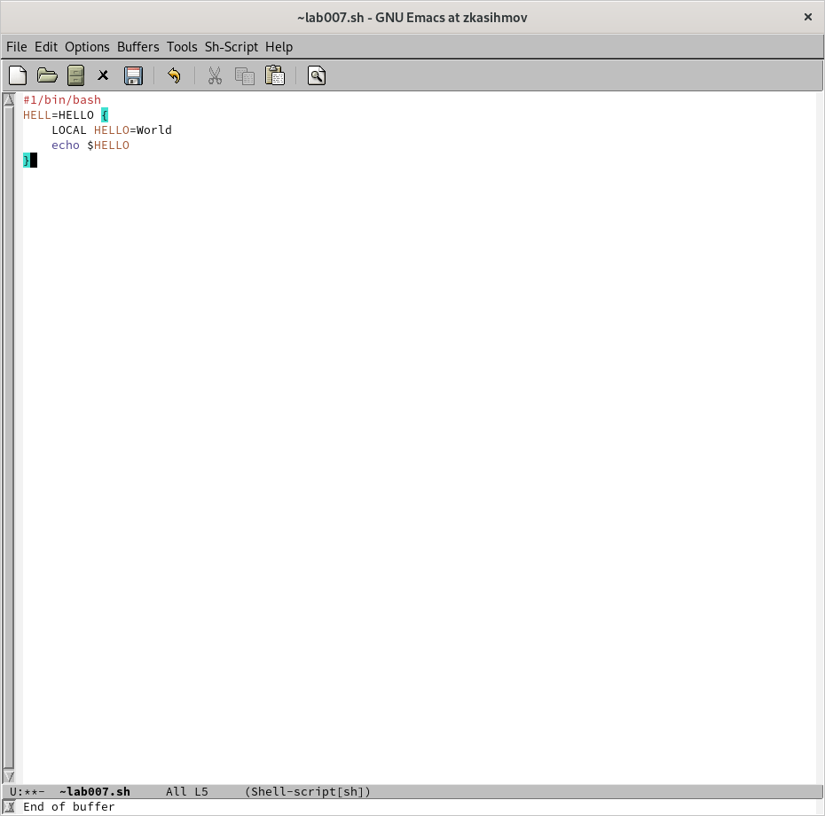
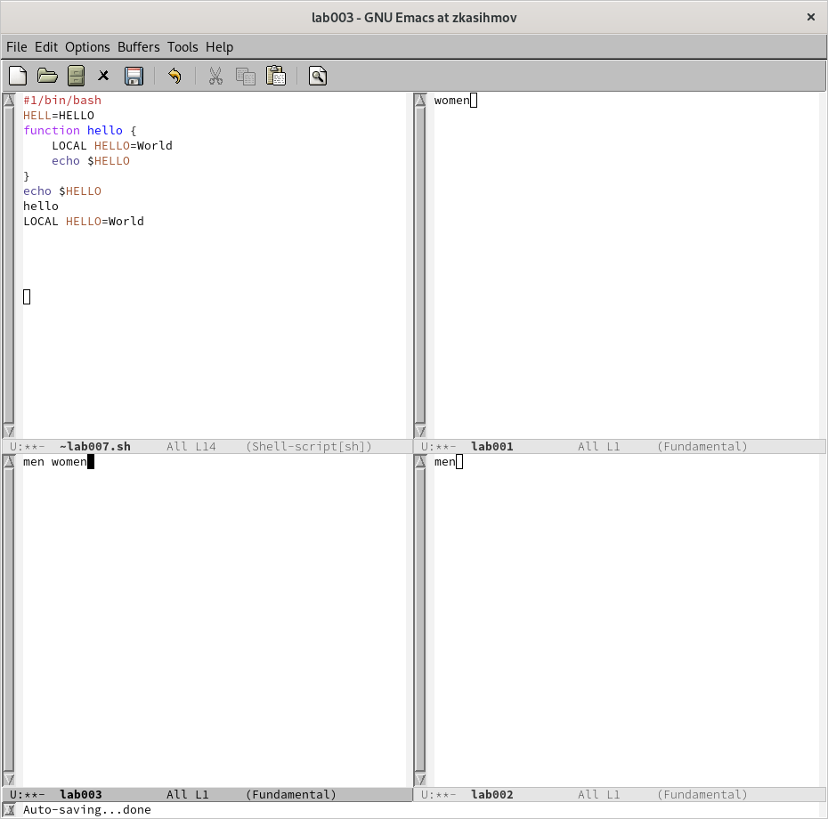
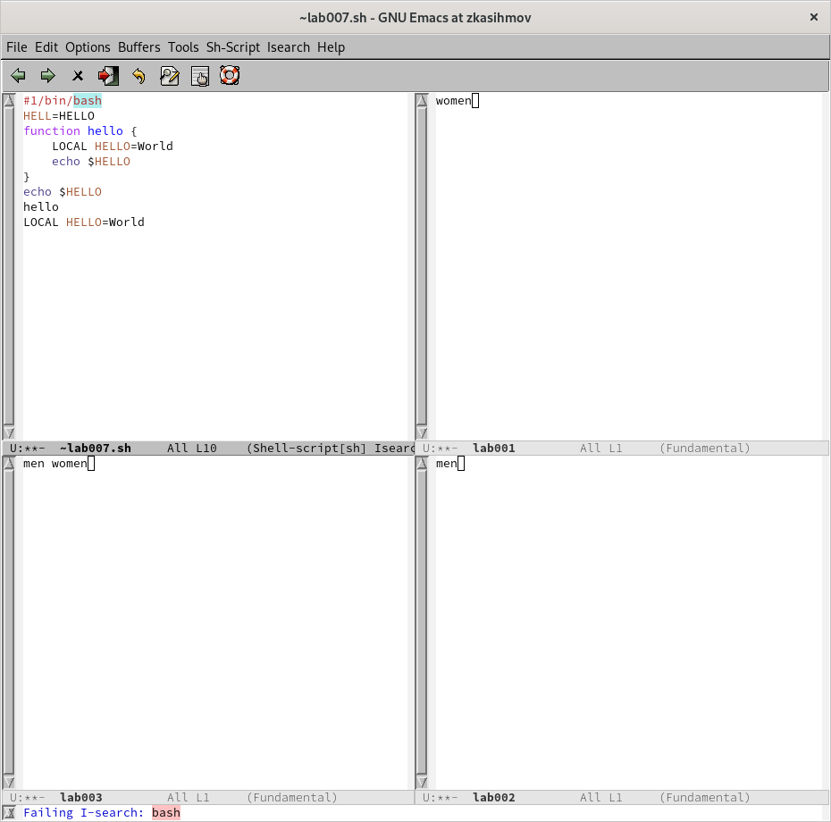

---
## Front matter
lang: ru-RU
title: "Лабораторная работа №9"
subtitle: "Текстовой редактор emacs"
author: "Касымов Заур"

## i18n babel
babel-lang: russian
babel-otherlangs: english

## Formatting pdf
toc: false
toc-title: Содержание
slide_level: 2
aspectratio: 169
section-titles: true
theme: metropolis
header-includes:
 - \metroset{progressbar=frametitle,sectionpage=progressbar,numbering=fraction}
 - '\makeatletter'
 - '\beamer@ignorenonframefalse'
 - '\makeatother'
---

# Информация

## Докладчик

:::::::::::::: {.columns align=center}
::: {.column width="70%"}

  * Касфмов Заур
  * студент
  * Российский университет дружбы народов
  
:::
::: {.column width="30%"}

:::
::::::::::::::

## Актуальность

Актуально

## Цели и задачи

Познакомиться с операционной системой Linux. Получить практические навыки рабо-
ты с редактором Emacs.

## Материалы и методы
1. Ознакомиться с теоретическим материалом.
2. Ознакомиться с редактором emacs.
3. Выполнить упражнения.
4. Ответить на контрольные вопросы

## Содержание исследования

3. Наберите текст (рис. @fig:003).

{#fig:003 width=70%}

## Результаты

9. Режим поиска
- 9.1. Переключитесь в режим поиска (C-s) и найдите несколько слов, присутствующих
в тексте (рис. @fig:015).

{#fig:015 width=70%}

- 9.2. Переключайтесь между результатами поиска, нажимая C-s (рис. @fig:015).

{#fig:015 width=70%}

## Итоговый слайд
Познакомились с операционной системой Linux. Получили практические навыки рабо-
ты с редактором Emacs.

:::

